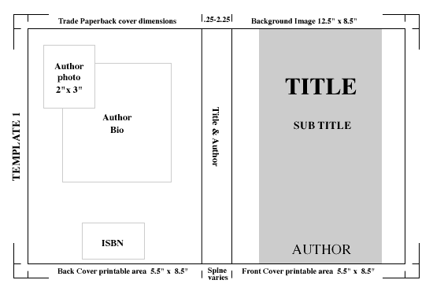

--- 
title:       "Tidy Book Template"
author:      "Harel Lustiger"
subtitle:    "A Guide for How to Deploy a Book."
description: "A Guide for How to Deploy a Book."
url:         "https://template-book.netlify.com/"
github-repo: "Kiwi-Random-House/template.book"
date:        "2020-06-25"
site: bookdown::bookdown_site
documentclass: book
bibliography: [references.bib]
biblio-style: apalike
link-citations: yes
graphics: yes
always_allow_html: yes
cover-image: ""
favicon:     "favicon.ico"
---

 



# Welcome {-}

This is the online version of _Tidy Book Template_, a book
**currently under early development** and intended for a late 
2020 release by [Kiwi Random
House](https://github.com/Kiwi-Random-House).

## License {-}

This book is licensed to you under [Creative Commons
Attribution-NonCommercial-NoDerivatives 4.0 International
License](http://creativecommons.org/licenses/by-nc-nd/4.0/).

The code samples in this book are licensed under [Creative Commons CC0 1.0
Universal (CC0 1.0)](https://creativecommons.org/publicdomain/zero/1.0/), i.e.
public domain.


## Colophon {-}

This version of the book was built with R version 4.0.0 (2020-04-24) and the following
packages:


|Package |Version |Description                                                      |
|:-------|:-------|:----------------------------------------------------------------|
|ggplot2 |3.3.0   |Create Elegant Data Visualisations Using the Grammar of Graphics |

You can install all of the packages at once by running:


```r
install.packages(c(
  "ggplot2" 
))
```
