# Using the Template {#demo}

## Create a New Book on GitHub using the Template

<center></center>

***

## Link the Book with Travis

1. Go to [travis-ci.org](https://travis-ci.org/) (not travis-ci.com);
2. Authorise Travis access to the book’s GitHub repo; and
3. Toggle legacy service integration for the book’s GitHub repo.

<center>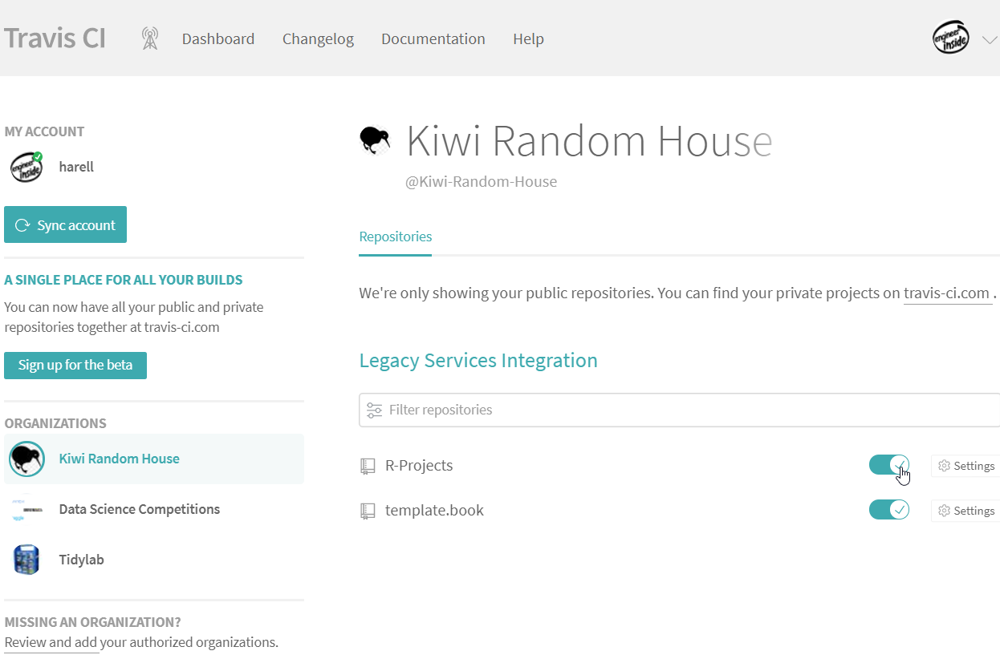</center>

***

## Add GitHub API to Travis

1. Generate GitHub Personal Access Token (PAT) by either:
  *	Following the instructions provided on GitHub Help pages; or
  *	Running the command ```usethis::browse_github_token()```.
2. Add PAT as an environment variable named `GITHUB_PAT` within project setting.

<center>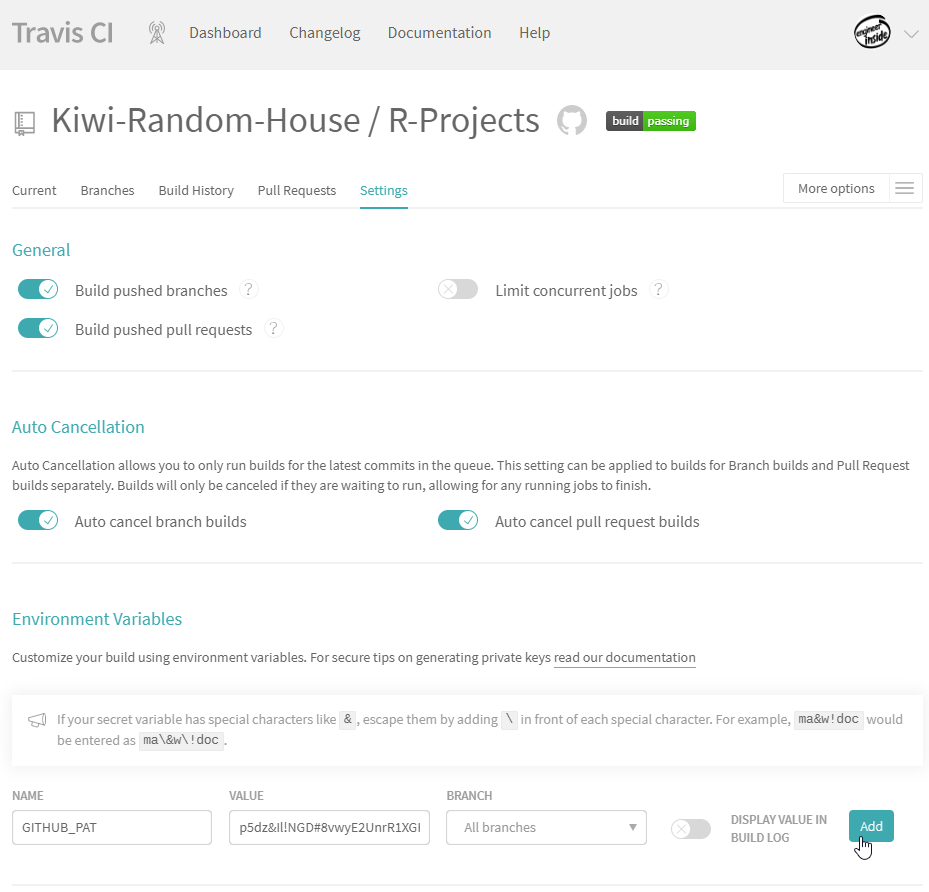</center>

***

## Trigger Travis to Deploy the Book

Trigger the first deployment on the *master* and *develop* branches.
You can do it either:

* Directly from GitHub by pushing changes into a new branch call *develop*; or
* Through [SourceTree](https://www.sourcetreeapp.com/) by:
  1. Cloning the repo to local computer through SourceTree;
  2. Initiating Git-flow; and
  3. Starting a new release named *book-inception*.

At this stage of using the template, there are several items we can update:

1. Rename `template.book.Rproj` to `<book-name>.Rproj`; and
2. Update the **Title**, **Description** and **Date** fields in DESCRIPTION.

Finally commit the changes:

* If you use GitHub website, then push the changes to the *develop* branch and
merge the *master* branch.
* If you use SourceTree, then finish the release and push changes to remote.

<center>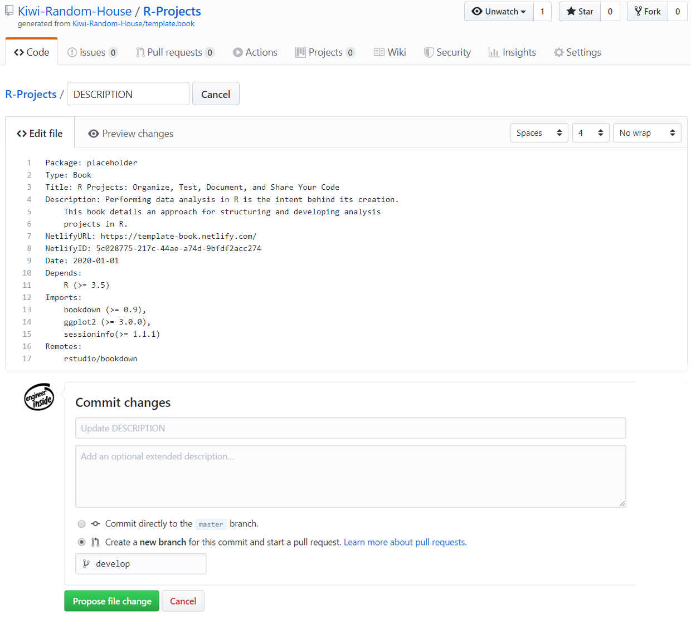</center>

The first deployment takes ~9 minutes to complete. At the end of a
successful run, two new branches appear in the GitHub repo: *gh-pages* and
*gh-preview*.

***

## Link the Book with Netlify

1. Go to https://app.netlify.com/; and
2. Follow the illustrations.

<center>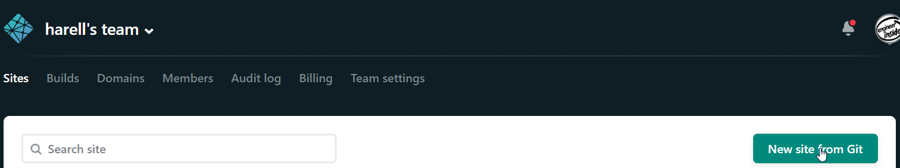</center>

<center>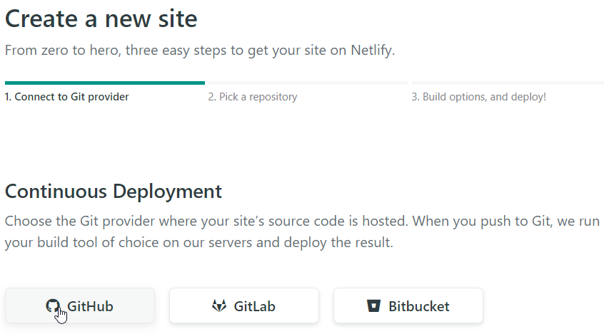</center>

<center>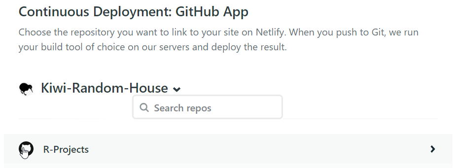</center>

Modify the following by clicking on "Build settings" at the right navigation
bar. Then, click "Edit settings" under "Deploy contexts":

1. Set "Production branch" to gh-pages;
2. Set "Branch deploys" to "Let me add individual branches"; and 
3. Add gh-preview under "Additional branches". 

<center>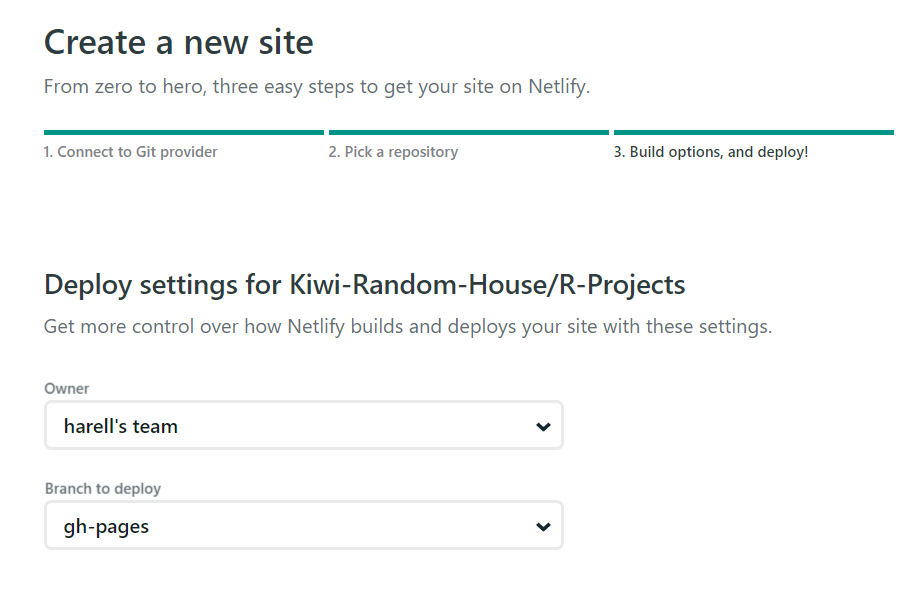</center>

<center>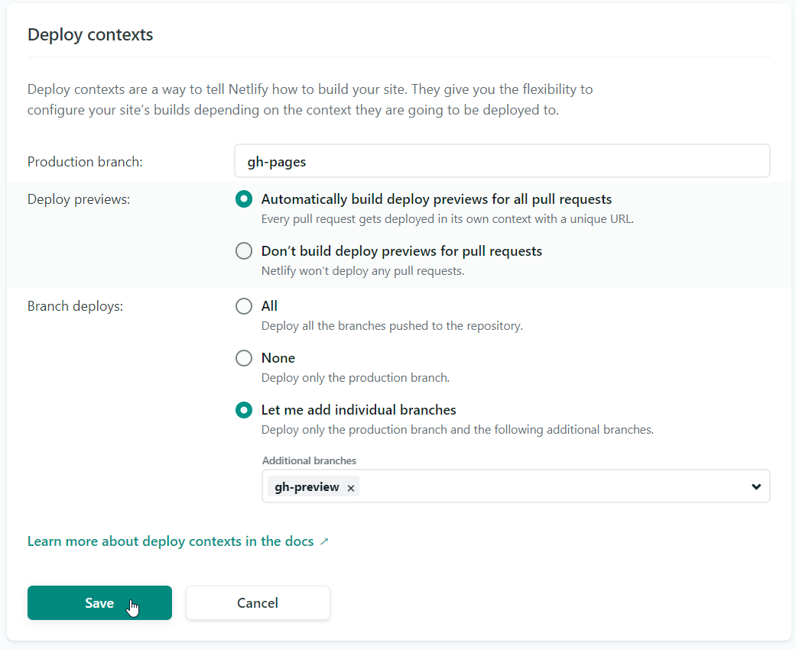</center>

***

## Update Site Name on Netlify

<center>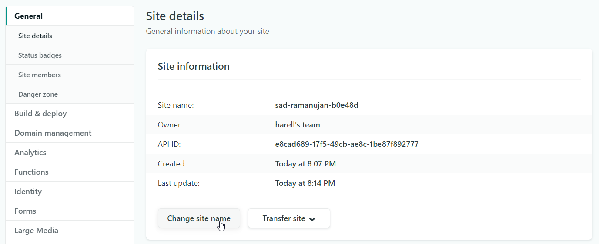</center>

***

## Update Netlify Fields within DESCRIPTION 

1. Update **NetlifyURL** with the site URL; and
2. Update **NetlifyID** with API ID.

<center>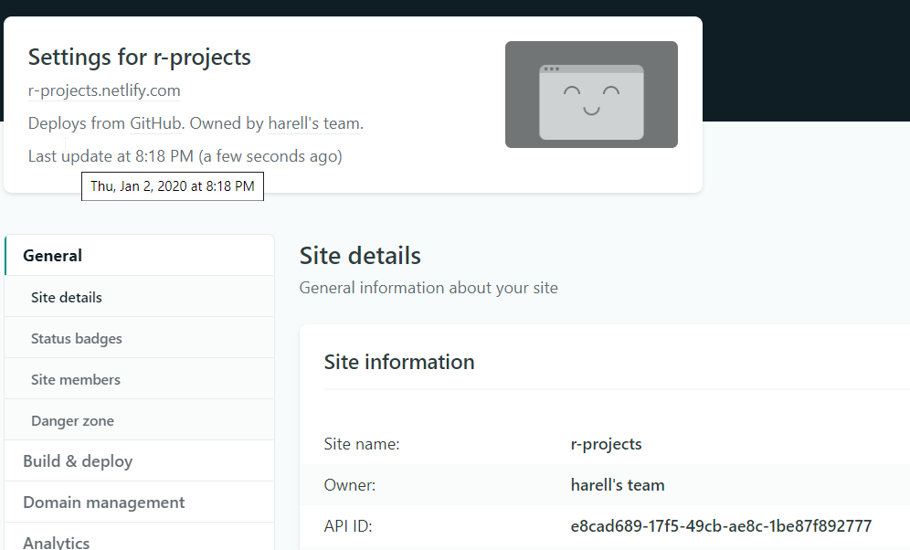</center>

<center>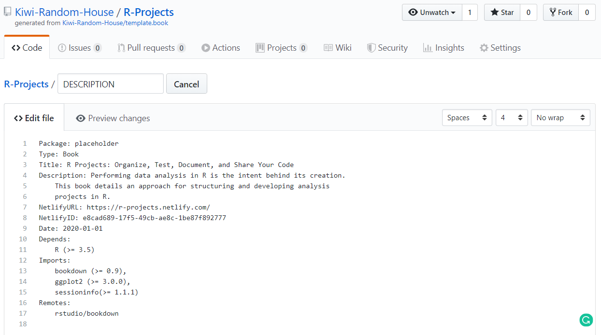</center>

***

## Update GitHub README File

1. Render README.Rmd in R
2. Push changes 

<center>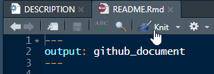</center>

<center>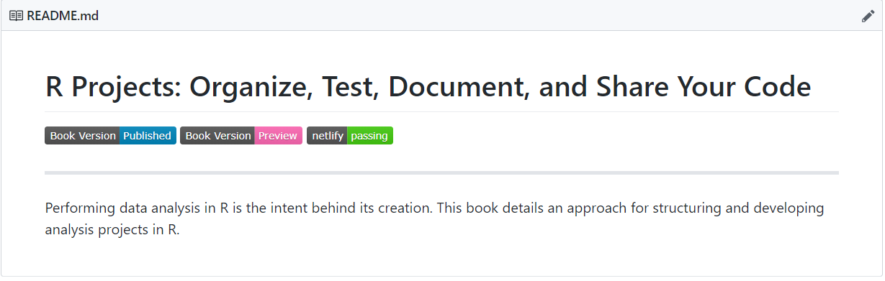</center>

***

`r emo::ji("clap")` Congratulations, you've made it!