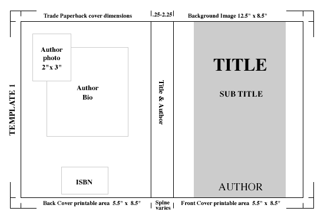

--- 
title: "`r DESCRIPTION$get_field('Title')`"
author: "`r paste(unlist(DESCRIPTION$get_author())[c('given', 'family')], collapse = ' ')`"
subtitle: "`r DESCRIPTION$get_field('Description')`"
description: "`r DESCRIPTION$get_field('Description')`"
url: "`r DESCRIPTION$get_urls()`"
date: "`r Sys.Date()`"
site: bookdown::bookdown_site
documentclass: book
bibliography: [references.bib]
biblio-style: apalike
link-citations: yes
graphics: yes
always_allow_html: yes
cover-image: "images/cover.png"
favicon: "favicon.ico"
---

<!--
Springer book structure
https://www.springer.com/gp/authors-editors/book-authors-editors/resources-guidelines/book-manuscript-guidelines/book-structure/5640
-->

`r if (knitr::is_latex_output()) '<!--'` 

```{r} 

```

# Welcome {-}

This is the online version of _`r DESCRIPTION$get_field("Title")`_, a book
**currently under early development** and intended for a late
`r format(Sys.Date(), "%Y")` release.

### License {-}

This book is licensed to you under [Creative Commons
Attribution-NonCommercial-NoDerivatives 4.0 International
License](http://creativecommons.org/licenses/by-nc-nd/4.0/).

The code samples in this book are licensed under [Creative Commons CC0 1.0
Universal (CC0 1.0)](https://creativecommons.org/publicdomain/zero/1.0/), i.e.
public domain.

`r if (knitr::is_latex_output()) '-->'`

